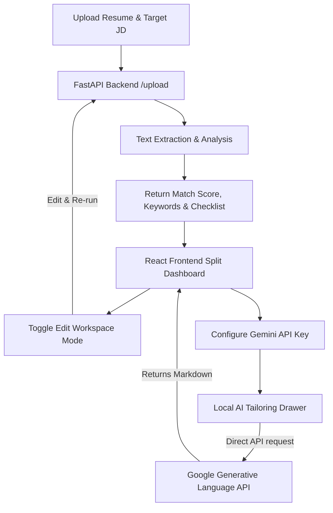

# 🚀 Smart ATS Resume Analyzer & Career Tailor

An advanced, real-time developer dashboard designed to audit resumes against job requirements, evaluate parser compatibility, and leverage Gemini AI to optimize achievements, draft cover letters, and prepare for interviews.

---

## ⚡ Key Features

* **Split-Screen Dashboard Layout**: A sleek side-by-side workspace featuring persistent uploader and job requirement panels on the left, and interactive reports on the right.
* **ATS Quality Checklist Audit**: Instant diagnostics checking for email/phone contact elements, social profiles (LinkedIn, GitHub), and standard resume sections (Experience, Education, Projects, Skills).
* **Live Workspace Editor**: Direct text-editing workspace inside the browser. Make quick adjustments and re-analyze the resume structure in real-time.
* **Interactive Keyword Diagnostics**: Color-coded breakdown distinguishing between **Matched (Green)** and **Missing (Amber)** keywords extracted from the target job requirements.
* **AI Optimizer Suite (Powered by Gemini)**:
  * **Resume Bullet Tailoring**: Automatically drafts experience bullet points starting with strong action verbs and ending with quantifiable results.
  * **Custom Cover Letters**: Instantly writes tailored cover letters mapping resume matches to the target role.
  * **Interview Preparation Sheets**: Generates a set of STAR-method behavioral and technical preparation questions.
* **Live Connection Ping**: Automatically verifies backend status in the navigation bar using periodic health checks.

---

## 🛠️ Technology Stack

| Layer | Technology | Purpose |
| :--- | :--- | :--- |
| **Frontend** | React 19 (Vite) | Main component framework and client interface |
| | Tailwind CSS 4 | Modern utility-first layout styling and responsiveness |
| | Axios | REST client to handle uploads to the backend API |
| **Backend** | FastAPI (Python) | High-performance routing engine for resume parsing |
| | Uvicorn | ASGI server implementation |
| | pdfplumber | PDF extraction library |
| **AI Layer** | Gemini API (`gemini-2.5-flash`) | Contextual bullet point rewrites, letter drafting, and Q&As |

---

## 📐 How It Works (Data Flow)



1. **Upload & Parse**: The candidate uploads a resume (PDF, DOCX, or TXT). The FastAPI backend extracts textual content using `pdfplumber` and runs regular expression pattern audits for structure and contact links.
2. **Evaluate & Rank**: The backend compares resume keyword distributions against target job description terms and calculates a weighted matching score.
3. **Client Optimization**: The frontend displays structural gaps and missing keywords. If the user enters a Gemini API key (stored securely in browser `localStorage`), they can trigger requests directly from the client to Gemini to tailor their experiences.

---

## ⚙️ Setup and Running Guide

Ensure you have **Python 3.10+** and **Node.js 18+** installed.

### 1. Backend Server Setup

```bash
# Navigate to Backend folder
cd Backend

# Create a virtual environment
python -m venv venv

# Activate virtual environment
# On Windows:
.\venv\Scripts\activate
# On macOS/Linux:
source venv/bin/activate

# Install dependencies
pip install -r requirements.txt

# Start Uvicorn
python -m uvicorn main:app --reload
```
*The API is now running locally at: `http://127.0.0.1:8000`*

### 2. Frontend App Setup

In a new terminal window:

```bash
# Navigate to Frontend folder
cd Frontend

# Install node packages
npm install

# Run the Vite server
npm run dev
```
*The web interface is now running at: `http://localhost:5173/`*

---

## 🔒 Local Privacy Guarantee

* **Secure Keys**: Your Gemini API Key is never sent to the backend. It is stored inside your browser's private local storage and sent directly to Google APIs via standard HTTP requests.
* **No Database Logging**: Resume files and job description texts are processed in memory and never stored on disk.
